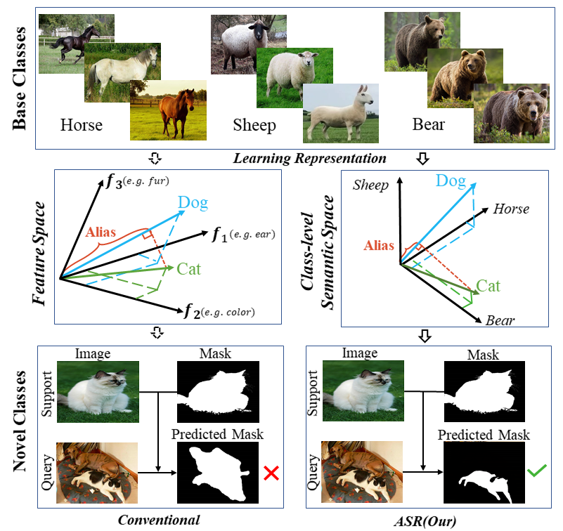

# ASR  

### Introduction  
Encouraging progress in few-shot semantic segmentation
has been made by leveraging features learned upon
base classes with sufficient training data to represent novel
classes with few-shot examples. However, this feature sharing
mechanism inevitably causes semantic aliasing between
novel classes when they have similar compositions of semantic
concepts. In this paper, we reformulate few-shot segmentation
as a semantic reconstruction problem, and convert
base class features into a series of basis vectors which
span a class-level semantic space for novel class reconstruction.
By introducing contrastive loss, we maximize the
orthogonality of basis vectors while minimizing semantic
aliasing between classes. Within the reconstructed representation
space, we further suppress interference from other
classes by projecting query features to the support vector
for precise semantic activation. Our proposed approach,
referred to as anti-aliasing semantic reconstruction (ASR),
provides a systematic yet interpretable solution for few-shot
learning problems. Extensive experiments on PASCAL VOC
and MS COCO datasets show that ASR achieves strong results
compared with the prior works.  

 
  

### Requirements  
Pytorch>=1.1  
Numpy  
matplotlib  

### Data preparation  
PASCAL VOC dataset  
MS COCO dataset  

### Train&Test  
main.ipynb  

### License  
[here](https://github.com/Bibkiller/ASR/edit/main/README.md)  

To be updated

